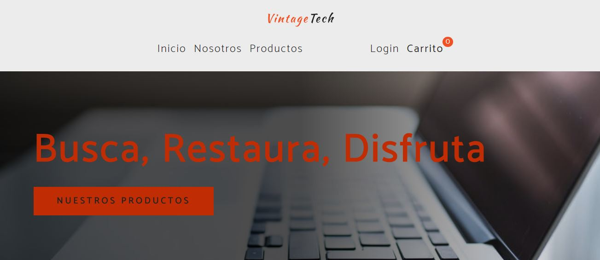
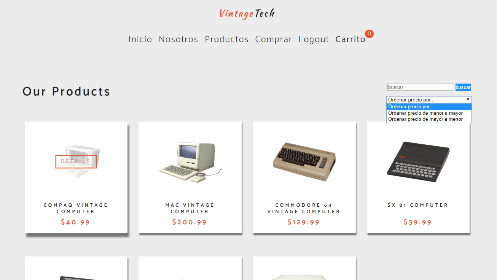
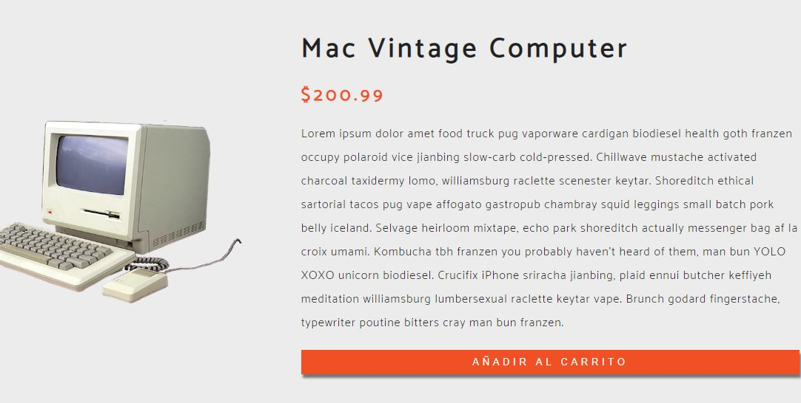
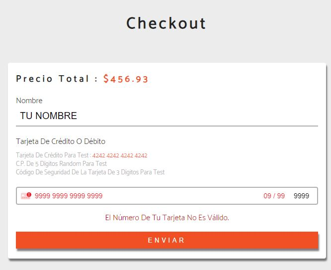

# **e-Commerce üöÄ**


---
## Demo E-commerce con REACT

Sitio web e-commerce, con registro, login de usuario, carrito de pedidos y productos.

## Tecnologías usadas e instalación 🛠️

* [mongoDB](https://www.mongodb.com/es) <--- Link a la documentación
* [mongoose](https://mongoosejs.com/) <--- Link a la documentación
* [Axios](https://github.com/axios/axios) <--- Link a la documentación
* [React](https://es.reactjs.org/) <--- Link a la documentación

> npm i

ejecuta este comando tras la descarga o clonación para que el proyecto funcione en tu máquina

## Tecnologías Front-end ⚙️
```
    "axios": "^0.19.0",
    "react": "^16.12.0",
    "react-dom": "^16.12.0",
    "react-icons": "^3.8.0",
    "react-router-dom": "^5.1.2",
    "react-scripts": "3.2.0",
    "react-stripe-elements": "^6.0.1"
```
## Tecnologías Back-end ⚙️
```
        "bcryptjs": "^2.4.3",
        "express": "^4.17.1",
        "jsonwebtoken": "^8.5.1",
        "mongoose": "^5.9.10",
        "morgan": "^1.10.0",
        "nodemailer": "^6.4.6"
```


* La p√°gina del home contiene los productos destacados mas abajo
 


* Disponemos de listado de productos



* Productos detallados




* Un registro de usuarios y su login/logout para efectuar compras y disponer de carrito de la compra


* Carrito de la compra con control de stock y precio total


* Finalizar la compra con método de pago por tarjeta



* Sección sobre nuestra empresa


---

## **Autor** ✒️

[Iñigo Vadillo](https://www.linkedin.com/in/i%C3%B1igovadilloruiz/)

* Guía

[e-commerce youtube](https://www.youtube.com/watch?v=wPQ1-33teR4)